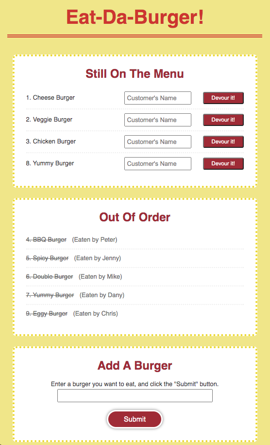

# Eat-Da-Burger2 (Sequelized)

### Overview
Sequelized the Burger app I made before, and added Customer Associations

### Links
- [Link to the page](https://yuko-sequelized-burger.herokuapp.com/)
- [Link to the code](https://github.com/yuda0110/sequelized-burger)

### Tech/framework used

- JavaScript
- jQuery
- Node
- [express](https://www.npmjs.com/package/express)
- [express-handlebars](https://www.npmjs.com/package/express-handlebars)
- [morgan](https://www.npmjs.com/package/morgan)
- [nodemon](https://www.npmjs.com/package/nodemon)
- [mysql2](https://www.npmjs.com/package/mysql2)
- [sequelize](https://www.npmjs.com/package/sequelize)
